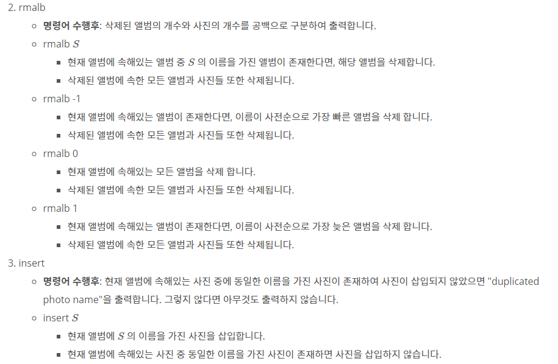
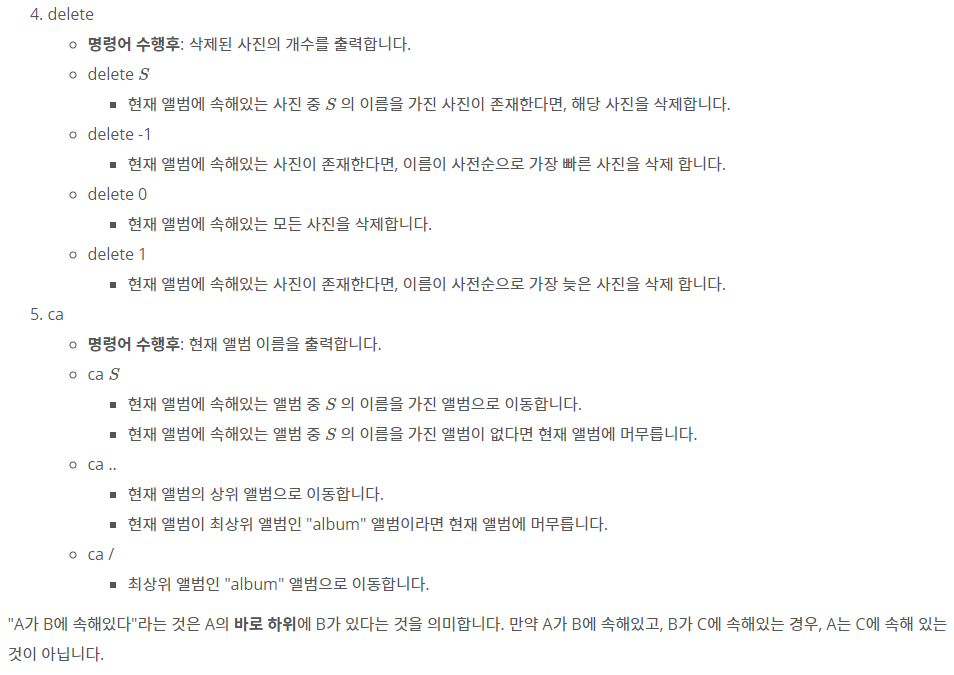

## [[20541] 앨범정리](https://www.acmicpc.net/problem/20541)





___
## **풀이**
- 현재 앨범에서 이름이 동일한 하위 앨범이나, 사진이 존재하면 안되므로 다음과 같은 자료구조를 사용해야 한다.
- `앨범`은 `map` 자료구조를 이용하여 앨범 이름과 하위 앨범들을 저장하였다.
- `사진`은 `set` 자료구조를 이용하여 사진 이름을 저장하였다.
- 현재 앨범에서 `상위 앨범`, `하위 앨범`, `사진`, `앨범 이름`, `앨범 개수`, `사진 개수` 데이터를 유지 및 관리하여야 한다.
	- 또한, 하위 앨범에 존재하는 앨범과 사진의 총 개수를 상위 앨범에서 관리하도록 구현하여야 한다.
	- 그렇지 않으면, 삭제 연산을 수행할 때 마다 모든 하위 앨범을 탐색해야하므로 비효율적이다.
- 따라서, 아래와 같이 `album 구조체`를 생성하였다.
```c++
struct album {
	album* parent; // 상위 앨범
	map<string, album*> albums; // 하위 앨범 목록
	set<string> pictures; // 현재 앨범에 존재하는 사진 목록
	string name; // 현재 앨범의 이름
	int size_alb; // 현재 앨범 + 하위 앨범들에 존재하는 총 앨범 개수
	int size_pic; // 현재 앨범 + 하위 앨범들에 존재하는 총 사진 개수

	album(string name, album* parent)
		: parent(parent), name(name), size_alb(0), size_pic(0) {}
};
```
- `mkalb`
	- 먼저, map의 메소드 `lower_bound`를 이용하여 추가할 album의 위치를 찾는다.
		- 만약 반환된 iterator가 end()이거나, 해당 iterator에 존재하는 album과 이름이 동일하다면 추가하지 않고, "duplicated album name"을 출력한다.
	- map의 메소드 `emplace_hint`를 사용하면 주어진 parameters를 바탕으로 해당하는 컨테이너를 찾아서 해당 iterator 위치의 앞에 추가해준다.
	- 해당 album을 추가한 이후, 현재 album과 모든 상위 albums에 album 개수를 1 증가시킨다.
```c++
void mkalb(album* cur, const string& name) {
	auto iter = cur->albums.lower_bound(name);
	if (iter == cur->albums.end() || iter->first != name) {
		cur->albums.emplace_hint(iter, name, new album(name, cur));
		while (cur != nullptr) {
			cur->size_alb++;
			cur = cur->parent;
		}
	}
	else
		cout << "duplicated album name\n";
}
```

- `rmalb`
	- 현재 album이 비어있다면, "0 0"을 출력하고 함수를 종료한다.
	- 그렇지 않다면, 아래의 규칙대로 수행한다.
		- name이 `-1`인 경우
			- 현재 album의 맨 앞의 하위 album을 제거한다.
		- name이 `0`인 경우
			- 현재 album의 모든 하위 album을 제거한다.
		- name이 `1`인 경우
			- 현재 album의 맨 뒤의 하위 album을 제거한다.
		- 하위 album에 `이름이 name`인 album이 존재하는 경우
			- map의 메소드 `find`를 사용하여 해당 위치의 iterator를 찾아서 해당 album을 제거한다.
			- 만약, 해당 album이 존재하지 않으면 "0 0"을 출력하고 함수를 종료한다.
	- 위의 작업이 끝나면, 현재 album을 포함한 모든 상위 albums에 보유한 album 개수, picture 개수를 조정한다.
```c++
void rmalb(album* cur, const string& name) {
	if (cur->albums.empty()) {
		cout << "0 0\n";
		return;
	}

	int cnt_alb, cnt_pic;
	if (name == "-1") {
		auto iter = cur->albums.begin();
		cnt_alb = iter->second->size_alb + 1; // 맨 앞의 album도 지우므로 + 1
		cnt_pic = iter->second->size_pic;
		cur->albums.erase(iter);
	}
	else if (name == "0") {
		cnt_alb = cur->size_alb;
		cnt_pic = cur->size_pic - cur->pictures.size();
		cur->albums.clear();
	}
	else if (name == "1") {
		auto iter = --(cur->albums.end());
		cnt_alb = iter->second->size_alb + 1; // 맨 뒤의 album도 지우므로 + 1
		cnt_pic = iter->second->size_pic;
		cur->albums.erase(iter);
	}
	else {
		auto iter = cur->albums.find(name);
		if (iter == cur->albums.end()) {
			cout << "0 0\n";
			return;
		}
		cnt_alb = iter->second->size_alb + 1;
		cnt_pic = iter->second->size_pic;
		cur->albums.erase(iter);
	}

	cout << cnt_alb << ' ' << cnt_pic << '\n';
	while (cur != nullptr) {
		cur->size_alb -= cnt_alb;
		cur->size_pic -= cnt_pic;
		cur = cur->parent;
	}
}
```

- `insert`
	- 먼저, map의 메소드 `lower_bound`를 이용하여 추가할 picture의 위치를 찾는다.
		- 만약 반환된 iterator가 end()이거나, 해당 iterator에 존재하는 picture과 이름이 동일하다면 추가하지 않고, "duplicated photo name"을 출력한다.
	- map의 메소드 `emplace_hint`를 사용하면 주어진 parameters를 바탕으로 해당하는 컨테이너를 찾아서 해당 iterator 위치의 앞에 추가해준다.
	- 해당 album을 추가한 이후, 현재 album과 모든 상위 albums에 picture 개수를 1 증가시킨다.
```c++
void insert(album* cur, const string& name) {
	auto iter = cur->pictures.lower_bound(name);
	if (iter == cur->pictures.end() || *iter != name) {
		cur->pictures.emplace_hint(iter, name);
		while (cur != nullptr) {
			cur->size_pic++;
			cur = cur->parent;
		}
	}
	else
		cout << "duplicated photo name\n";
}
```

- `delete`
	- 현재 album에 picture가 없다면, "0"을 출력하고 함수를 종료한다.
	- 그렇지 않다면, 아래의 규칙대로 수행한다.
		- name이 `-1`인 경우
			- 현재 album의 맨 앞의 picture를 제거한다.
		- name이 `0`인 경우
			- 현재 album의 모든 pictures를 제거한다.
		- name이 `1`인 경우
			- 현재 album의 맨 뒤의 하위 picture를 제거한다.
		- 현재 album에 `이름이 name`인 picture가 존재하는 경우
			- map의 메소드 `find`를 사용하여 해당 위치의 iterator를 찾아서 해당 picture를 제거한다.
			- 만약, 해당 picture가 존재하지 않으면 "0"을 출력하고 함수를 종료한다.
	- 위의 작업이 끝나면, 현재 album을 포함한 모든 상위 albums에 보유한 picture 개수를 조정한다.
```c++
void _delete(album* cur, const string& name) {
	if (cur->pictures.empty()) {
		cout << "0\n";
		return;
	}

	int cnt_pic;
	if (name == "-1") {
		cnt_pic = 1;
		cur->pictures.erase(cur->pictures.begin());
	}
	else if (name == "0") {
		cnt_pic = cur->pictures.size();
		cur->pictures.clear();
	}
	else if (name == "1") {
		cnt_pic = 1;
		cur->pictures.erase(--(cur->pictures.end()));
	}
	else {
		auto iter = cur->pictures.find(name);
		if (iter == cur->pictures.end()) {
			cout << "0\n";
			return;
		}
		cnt_pic = 1;
		cur->pictures.erase(iter);
	}

	cout << cnt_pic << '\n';
	while (cur != nullptr) {
		cur->size_pic -= cnt_pic;
		cur = cur->parent;
	}
}
```
- `ca`
	- 먼저, 앨범의 root를 이름이 "album"인 앨범으로 만들고, 현재 앨범의 위치를 나타내는 album 포인터형 변수 `cur`을 생성한다.
	```c++
	album* root = new album("album", nullptr);
	album* cur = root;
	```
	- name이 `..`인 경우
		- 상위 앨범으로 이동하되, 현재 앨범이 root인 경우 이동하지 않는다.
	- name이 `/`인 경우
		- root 앨범으로 이동하되, 현재 앨범이 root인 경우 이동하지 않는다.
	- name이 현재 album의 `하위 album` 중 하나인 경우
		- map의 메소드 `find`을 이용하여 해당 iterator를 찾고, 존재한다면 `cur`을 해당 album의 포인터로 갱신한다.
	```c++
	if (name == ".." && cur != root)
		cur = cur->parent;
	else if (name == "/" && cur != root)
		cur = root;
	else {
		auto iter = cur->albums.find(name);
		if (iter != cur->albums.end())
			cur = iter->second;
	}
	cout << cur->name << '\n';
	```